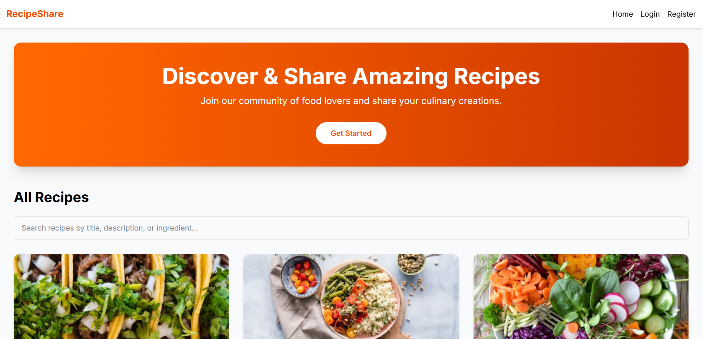
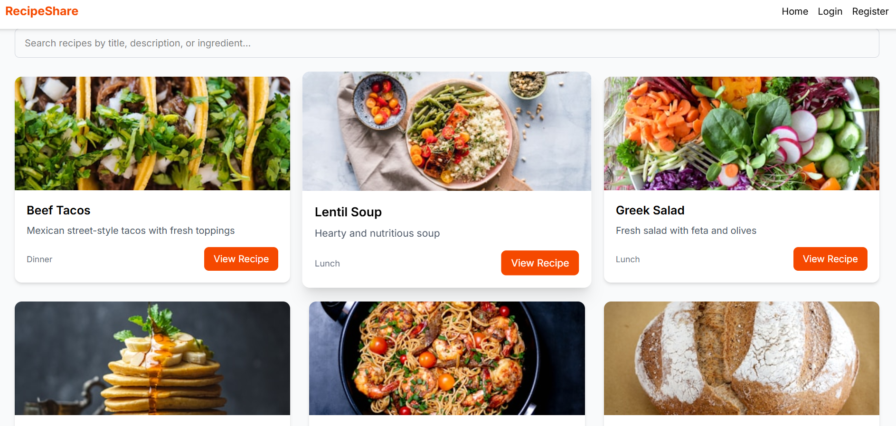
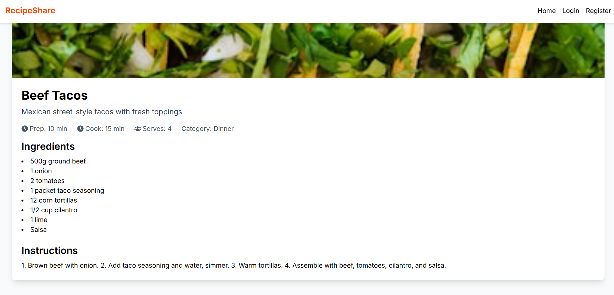

🍲 RecipeShare – Share & Discover Amazing Recipes
RecipeShare is a full‑stack web application where food lovers can browse, share, and manage their favorite recipes. Built with React, Vite, Tailwind CSS, and Firebase, it offers a smooth user experience with authentication, real‑time data, and image uploads.

✨ Features
🔐 User Authentication – Sign up, log in, and log out securely (Firebase Auth).

📝 Create & Manage Recipes – Add new recipes with title, description, ingredients, instructions, cooking times, and an optional image.

✏️ Edit & Delete – Only the owner of a recipe can edit or delete it.

🔍 Search & Filter – Find recipes by title, description, or ingredients.

👤 User Profile Page – View all recipes created by a specific user.

🖼️ Image Uploads – Upload recipe images to Firebase Storage.

📱 Fully Responsive – Works on desktop, tablet, and mobile.

⚡ Fast & Modern – Built with Vite for instant development and Tailwind CSS for styling.

🛠️ Tech Stack
Frontend	Backend & Services	Tools & Libraries
React (with Hooks)	Firebase Authentication	React Router DOM
Vite	Cloud Firestore (NoSQL)	React Hook Form (optional)
Tailwind CSS	Firebase Storage	React Icons
react-loading-skeleton

📸 Screenshots

Recipe Listing		

	

Recipe Detail

 

🧰 Getting Started
Follow these instructions to get a copy of the project up and running on your local machine for development and testing purposes.

Prerequisites
Node.js (v16 or later)

npm or yarn

A Firebase account (for backend services)

Installation
Clone the repository

bash
git clone https://github.com/Gezish-Webs/Recipe-Sharing-App.git
cd Recipe-Sharing-App
Install dependencies

bash
npm install
Set up Firebase

Create a new Firebase project at firebase.google.com.

Enable Authentication with Email/Password.

Create a Firestore Database (start in test mode).

Enable Storage (start in test mode).

Register a web app to get your Firebase config.

Environment variables

Copy the .env.example file to .env:

bash
cp .env.example .env

bash
npm run dev
Open http://localhost:5173 to view it in the browser.

🏗️ Building for Production
To create a production build:

bash
npm run build
The output will be in the dist folder, ready to be deployed to any static hosting service.

🌐 Deployment
This project is configured for easy deployment on Vercel.

Push your code to a GitHub repository.

Import the project on Vercel.

Add the environment variables (same as in .env).

Vercel will automatically detect Vite and apply the correct build settings.

Your app will be live at a *.vercel.app URL.

Note for client‑side routing:
The repository includes a vercel.json file (or you can use a _redirects file in the public folder) to ensure all routes are rewritten to index.html. This prevents 404 errors on direct page reloads.

📁 Project Structure
text
Recipe-Sharing-App/
├── public/               # Static assets (favicon, _redirects)
├── src/
│   ├── assets/           # Images, fonts
│   ├── components/       # Reusable UI components (NavBar, RecipeCard, Footer)
│   ├── contexts/         # React context (AuthContext)
│   ├── data/             # Sample recipes data
│   ├── hooks/            # Custom hooks (useAuth)
│   ├── pages/            # Page components (Home, RecipeDetail, Login, etc.)
│   ├── services/         # Firebase configuration and API calls
│   ├── App.jsx           # Main app with routes
│   ├── main.jsx          # Entry point
│   └── index.css         # Global styles (Tailwind)
├── .env.example          # Example environment variables
├── .gitignore
├── index.html
├── package.json
├── README.md
├── tailwind.config.js
├── vercel.json           # Routing configuration for Vercel
└── vite.config.js
🤝 Contributing
Contributions are welcome! If you have ideas for improvements or bug fixes, please:

Fork the repository.

Create a new branch (git checkout -b feature/your-feature).

Commit your changes (git commit -m 'Add some feature').

Push to the branch (git push origin feature/your-feature).

Open a Pull Request.

📄 License
This project is licensed under the MIT License – see the LICENSE file for details.

🙏 Acknowledgements
Unsplash for placeholder and sample images.

React Icons for the beautiful icons.

Tailwind CSS for the utility‑first styling.

Vercel for seamless hosting.

📧 Contact
Your Name – gezahegnaberamegenasa@gmail.com
GitHub: @GezishDev

⭐ If you like this project, don't forget to give it a star on GitHub! ⭐

